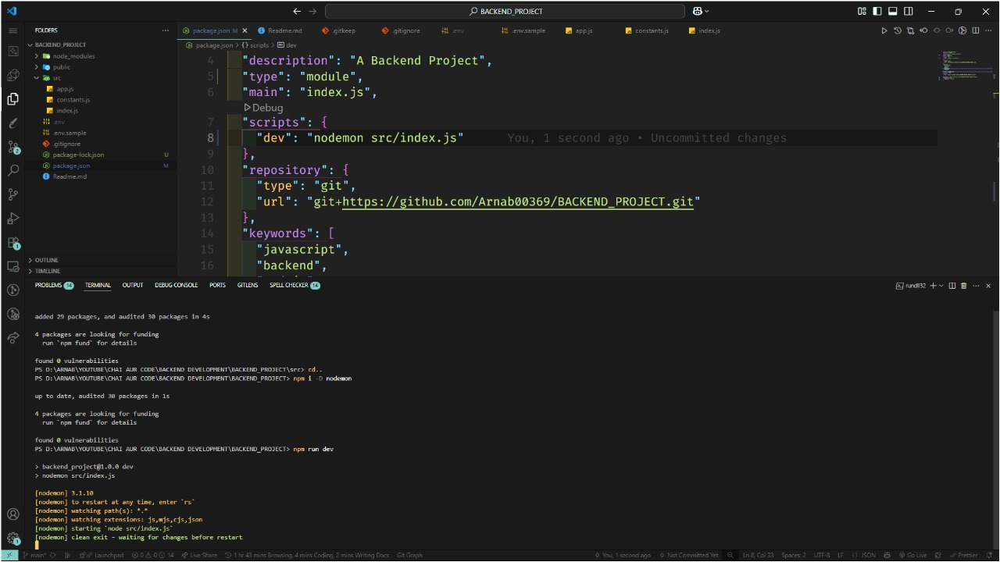
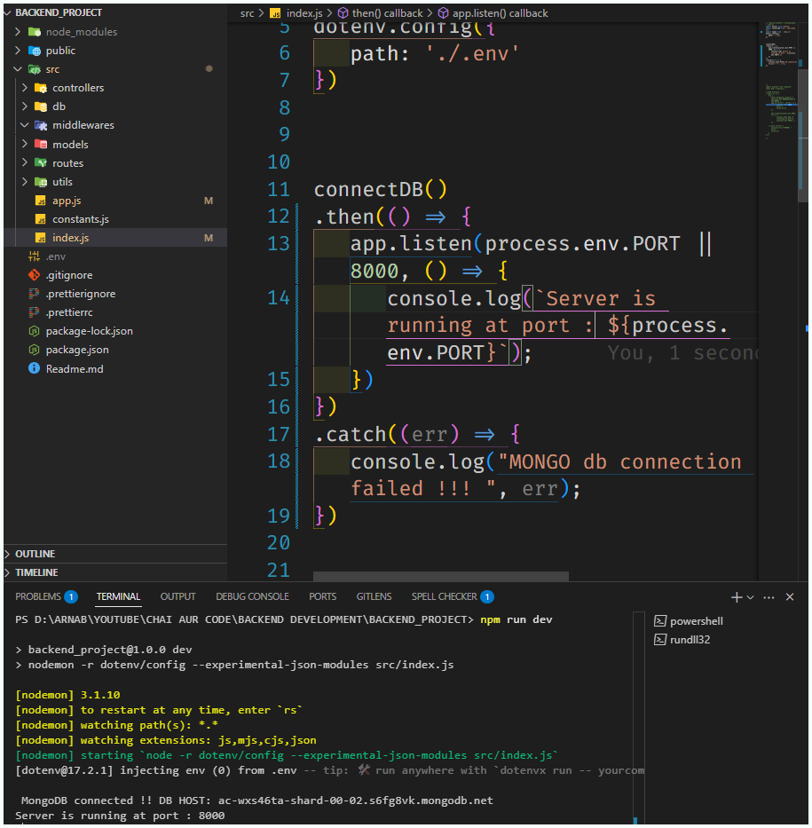
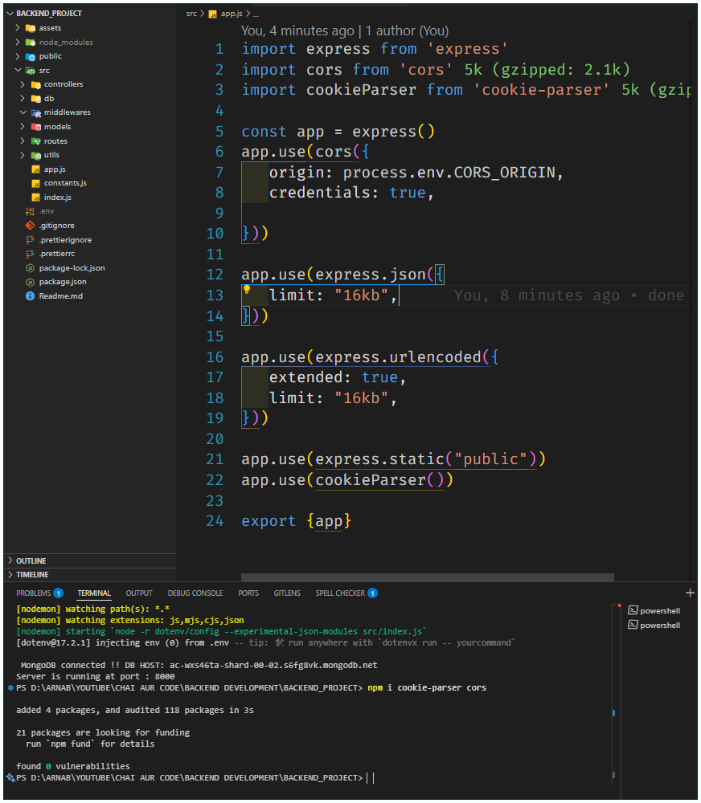

# 🎬 VideoTube - A Youtube like Backend Platform 🚀

A full-fledged 🔙 backend project that powers the core functionalities of a YouTube-like platform. This includes video upload & streaming APIs, user authentication, likes/dislikes, comments, subscriptions, and more. Built with **Node.js**, **Express**, and **MongoDB**.

## ✨ Guidelines:

---

## 📽️ Preview

> Sample Video Upload + User Auth Workflow (Postman Preview)

---

## 🛠️ Tech Stack

| Tech | Role |
|------|------|
| 🟩 **Node.js** | Runtime environment |
| ⚫ **Express.js** | Web framework |
| 🍃 **MongoDB + Mongoose** | Database & ODM |
| 🔐 **JWT** | Authentication |

| 🌐 **Postman** | API testing |
| 📦 **Nodemon** | Dev server |

---

## ✨ Features

- 🧑 User Signup / Login / JWT Auth
- 📤 Upload videos (Multer)
- 📺 Stream video content (via URL)
- ❤️ Like / Dislike videos
- 💬 Comment system (CRUD)
- 🔔 Subscribe / Unsubscribe to channels
- 📊 Get video analytics (views, likes, etc.)
- 🧾 API documentation via Postman

---

## 📁 Folder Structure

<h2>🚧 Future Improvements</h2>
  <ul>
    <li>Add playlists feature</li>
    <li>Add thumbnails using FFmpeg</li>
    <li>Implement video recommendation system</li>
    <li>Use Redis for caching views</li>
  </ul>

  <h2>🧠 Learning Outcomes</h2>
  <ul>
    <li>REST API design best practices</li>
    <li>Middleware in Express</li>
    <li>Token-based authentication</li>
    <li>File streaming and security</li>
    <li>Mongoose data modeling</li>
  </ul>

  <h2>🖼️ Screenshots</h2>
   

    
🗂️ <h3>Basic Files Setup and Nodemon: </h3>

      

    
  

  

   
🌐 <h3>Server Connection using PORT: 8000</h3>

      

    
  

  

    
🗂️ 🛠️ <h3>App file updation with 🌐 🔄 🛡️ CORS and 🍪 🔍 🔐 Cookie-Parser</h3>

      

    
  

 
  

    
📥 <h3>Upload API (Postman)</h3>

    

  

  

    
🔐 <h3>Auth API</h3>

    

  

  <h2>🤝 Contributing</h2>
  
Feel free to <strong>fork</strong> this repo and submit a pull request! For major changes, please open an issue first to discuss what you'd like to change.

  <h2>📜 License</h2>
  
This project is licensed under the <strong>MIT License</strong>.

  <h2>✉️ Contact</h2>
  

    📧 <strong><a href="mailto:your.email@example.com">arnab003jn.369@gmail.com</a></strong> 
    🌐 <strong><a href="https://yourportfolio.com" target="_blank">Portfolio Website</a></strong>
  

  

  <blockquote><em>“Backend is the brain of every great platform.”</em></blockquote>

</body>
</html>

“Backend is the brain of every great platform.”
